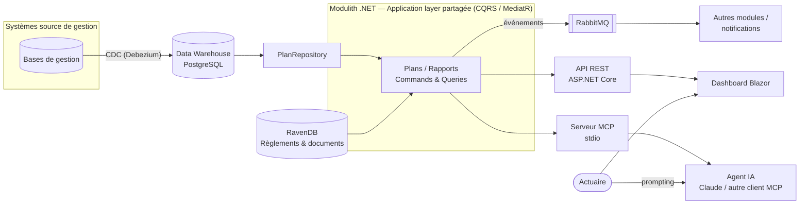

# Architecture — PrévoyanceInsight

## Contexte

Ce projet est un démonstrateur technique construit pour illustrer une réponse concrète
aux deux objectifs de l'offre "Développeur Full Stack .NET" :

1. Mettre à disposition du pôle actuariat une BI produisant les rapports nécessaires.
2. Mettre à disposition des outils d'IA permettant, via prompting, de produire et
   compléter ces rapports, d'effectuer des contrôles de masse, de modéliser les plans
   de prévoyance et de les comparer entre eux.

Il ne prétend pas remplacer l'architecture cible de la CPEG — dont je ne connais pas
le détail interne — mais démontre une manière crédible et idiomatique de répondre à ce
type de besoin avec la stack demandée.

## Vue d'ensemble



## Pourquoi ces choix

**CQRS avec MediatR.** Les lectures (statistiques, comparaisons) et les écritures
(détection d'anomalies, génération de rapport) sont séparées en objets explicites
(`Query`/`Command` + `Handler`). Cela permet d'optimiser les deux indépendamment (les
lectures peuvent être mises en cache ou déportées sur une réplique, les écritures
restent transactionnelles) et surtout de **partager exactement la même logique métier**
entre l'API REST et le serveur MCP : les deux ne sont que des transports différents
au-dessus du même `ISender`.

**Monolithe modulaire plutôt que microservices dès le départ.** L'annonce demande une
sensibilité "orientée micro-service". Le projet est structuré en modules avec des
frontières nettes (`Plans`, `Rapports`) communiquant par événements plutôt que par appel
direct — ce qui permet d'extraire un module en microservice indépendant sans réécrire
la logique métier, le jour où le volume ou l'équipe le justifie. C'est le chemin
pragmatique recommandé par la plupart des retours d'expérience sur les migrations vers
les microservices : commencer modulaire, découper quand la douleur organisationnelle
(pas seulement technique) apparaît.

**PostgreSQL pour le structuré, RavenDB pour le documentaire.** Les taux, effectifs et
cotisations sont naturellement relationnels et sont la source des calculs statistiques
— PostgreSQL. Les règlements de plans (texte long, versionné, interrogé par contenu) ne
gagnent rien à être découpés en colonnes — RavenDB. Le principe : ne pas choisir un seul
magasin par dogmatisme, mais un magasin par nature de données.

**RabbitMQ via MassTransit.** Découple la détection d'une anomalie de sa notification,
et la génération d'un rapport de sa traçabilité. Permet d'ajouter un futur consommateur
(alerting, audit) sans toucher au code existant.

**Serveur MCP.** C'est le point le plus directement lié à l'objectif 2 de l'annonce.
Plutôt que de construire une UI de reporting supplémentaire, on expose la même logique
métier comme des **outils** qu'un agent IA peut appeler via prompting : comparer des
plans, générer un rapport, lister les plans, détecter des anomalies. Un actuaire peut
alors demander en langage naturel "compare le plan cadres et le plan employés sur 2024"
et l'agent orchestre l'appel d'outil correspondant.

## Brancher le serveur MCP

Le serveur communique en stdio. Pour le connecter à Claude Desktop, ajouter dans sa
configuration :

```json
{
  "mcpServers": {
    "prevoyance-insight": {
      "command": "dotnet",
      "args": ["run", "--project", "src/PrevoyanceInsight.McpServer"]
    }
  }
}
```

## Ce qui est délibérément hors périmètre du démonstrateur

- Authentification/autorisation (SSO, rôles actuariat vs. IT) — à ajouter avant toute
  mise en production, non représentative d'un choix d'architecture différenciant.
- Le pipeline CDC lui-même (Debezium, Kafka Connect) — supposé déjà en place côté CPEG
  selon l'annonce ; seul le point de consommation (PostgreSQL) est modélisé ici.
- BI visuelle (Superset/Power BI) — le dashboard Blazor illustre la même idée à plus
  petite échelle ; brancher Superset sur le même PostgreSQL ne change rien à
  l'architecture applicative présentée.
